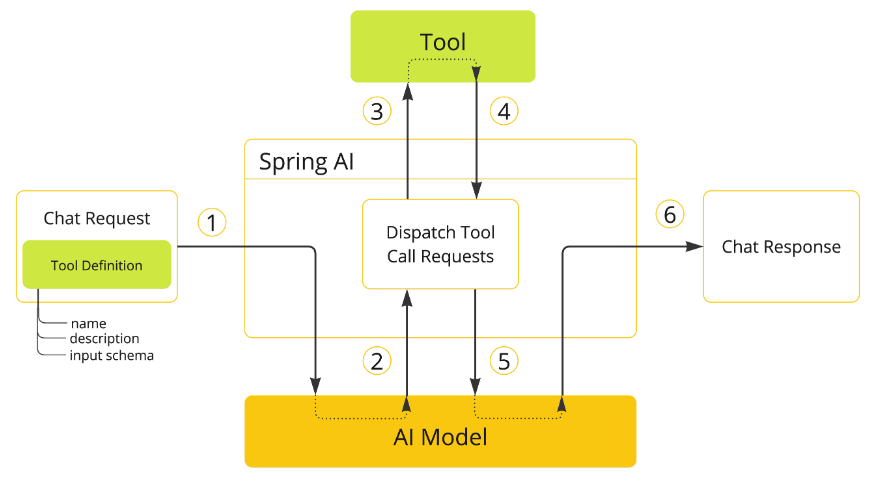

# 相关概念

> [!TIP]
>
> 本节介绍与 Spring AI 相关的核心概念我们应该仔细阅读以了解 Spring AI 是如何对相关概念进行抽象的，对于一些复杂数学理论背后的具体
> 实现(例如 嵌入模型中相似度的计算与矢量描述)作为探索 AI 的 Java 开发人员我们没有必要深入理解只需要对其概念有基本的了解就足够了.

## models

models 是一种旨在处理和生成信息的算法,通常可以模仿人类的认知功能 通过从大型数据集中学习模式和见解.这些模型可以进行预测、文本、图像或其他输出
从而增强跨行业的各种应用程序.有许多不同类型的 AI 模型 每种模型都适用于特定的使用案例.

下表根据模型的输入和输出类型对多个模型进行分类:


Spring AI 目前支持将输入和输出处理为语言、图像和音频的模型。上表中的最后一行接受文本作为输入并输出数字，通常称为嵌入文本，表示
AI 模型中使用的内部数据结构。Spring AI 支持嵌入以支持更高级的用例

> [!NOTE]
>
> What sets models like GPT apart is their pre-trained nature, as indicated by the "P" in GPT—Chat Generative
> Pre-trained Transformer. This pre-training feature transforms AI into a general developer tool that does not require
> an
> extensive machine learning or model training background.
>
> 像 GPT 这样的模型的不同之处在于它们的预训练性质，如 GPT 中的“P”所示——聊天生成预训练转换器。此预训练功能将 AI
> 转换为不需要广泛的机器学习或模型训练背景的通用开发人员工具

## prompts

prompts 是基于语言输入的基础这些输入可指导 AI 模型生成特定输出 对于熟悉 ChatGPT 的人来说，提示可能看起来只是在发送到 API
的对话框中输入的文
本 然而它包含的远不止于此 在许多 AI 模型中提示的文本不仅仅是一个简单的字符串

ChatGPT 的 API 在一个提示中有多个文本输入，每个文本输入都分配了一个角色 例如:

- `system role` 它告诉模型如何行为并设置交互的上下文
- `user role` 通常是来自用户的输入

制作有效的 `prompts` 既是一门艺术，也是一门科学 ChatGPT 专为人类对话而设计。这与使用 SQL 之类的东西来 `ask a question`
完全不同.一个人必须 与 AI 模型进行交流，类似于与另一个人交谈 正是这种交互方式的重要性,以至于 `Prompt Engineering`
一词已经成为一门独立的学科.
有一系列新兴的技术 可以提高`prompts`的有效性 投入时间制作`prompts`可以大大提高结果输出

分享 `prompts` 已成为一种公共实践，并且正在积极地进行关于这一主题的学术研究。例如，创建有效的提示（例如，与 SQL 形成对比）是多么违反直觉，
[最近的一篇研究论文](https://arxiv.org/abs/2205.11916)发现，您可以使用的最有效的提示之一以短语“深呼吸并逐步完成此工作”开头这应该可以告诉你为什么语言如此重要

### prompt templates

创建有效的 prompt 包括:

- 建立请求上下文
- 将请求的各个部分替换为特定于用户输入的值

此过程使用传统的基于文本的模板引擎进行提示创建和管理 Spring AI 为此使用了 OSS 库 `StringTemplate`

例如，考虑简单的提示模板：

```shell
Tell me a {adjective} joke about {content}.
```

在 Spring AI 中，提示模板可以比作 Spring MVC 架构中的 `视图提供模型对象`（通常是 java.util.Map）来填充模板中的占位符。
`rendered`
字符串成为提供给 AI 模型的提示的内容

发送到模型的提示的特定数据格式存在相当大的变化。提示最初从简单字符串开始，现在已经发展到包含多条消息，其中每条消息中的每个字符串代表模型的不同角色

## embeddings

嵌入是文本、图像或视频的数字表示形式，用于捕获输入之间的关系.嵌入的工作原理是将文本、图像和视频转换为浮点数数组（称为向量）.这些矢量旨在捕获文本、
图像和视频的含义。嵌入数组的长度称为向量的维数. 通过计算两段文本的向量表示之间的数值距离，应用程序可以确定用于生成嵌入向量的对象之间的相似性.


嵌入在 `Retrieval Augmented Generation （RAG）`模式等实际应用中尤其相关.它们能够将数据表示为语义空间中的点，这类似于欧几里得几何的二维空间
但维度更高。这意味着就像欧几里得几何中平面上的点可以根据其坐标来接近或远一样，在语义空间中，点的接近反映了含义的相似性.在这个多维空间中，关于相似主
题的句子被放置在更近的位置，就像图表上彼此靠近的点一样。这种接近有助于文本分类、语义搜索甚至产品推荐等任务，因为它允许 AI
根据相关概念在这个扩展的
语义环境中的 “位置” 来识别和分组.

> [!NOTE]
> 可以将此语义空间视为一个向量

## tokens

token 是 AI 模型工作原理的构建块:

- 在输入时模型将 words 转换为 tokens
- 在输出时他们将 tokens 转换为 words

在英语中，一个 token 大约相当于一个单词的 75%.作为参考，莎士比亚全集总计约 900,000 字，可翻译成大约 120 万个 token.


也许更重要的是 `token = 货币` 在托管 AI 模型的上下文中，您的费用由使用的 token 数量决定。输入和输出都会影响总 token 计数.

> [!TIP]
> 此外，模型还受令牌限制的约束，这些限制限制了在单个 API 调用中处理的文本量。此阈值通常称为 `上下文窗口` 模型不会处理任何超过此限制的文本
>
> 例如，ChatGPT3 有 4K token 限制，而 GPT4 提供不同的选项，例如 8K、16K 和 32K。Anthropic 的 Claude AI 模型具有 100K token 限制，而
> Meta 最近的研究产生了 1M token 限制模型


要使用 GPT4 总结莎士比亚的汇编作品，您需要设计软件工程策略来切碎数据并在模型的上下文窗口限制内呈现数据。Spring AI
项目可帮助您完成此任务。

## structure output

AI 模型的输出传统上以 `java.lang.String` 的形式到达，即使您要求以 JSON 格式回复也是如此。它可能是正确的 JSON，但不是 JSON
数据结构。它只是一个字符串。此外，在提示中请求 “for JSON” 并不是 100% 准确的.这种复杂性导致了一个专业领域的出现，该领域涉及创建提示以产生预期的输出，
然后将生成的简单字符串转换为可用于应用程序集成的数据结构.


结构化输出转换采用精心设计的提示，通常需要与模型进行多次交互才能获得所需的格式.

## bringing your data & APIs to the AI Model

如何为 AI 模型配备尚未训练的信息？

> [!TIP]
> 请注意，GPT 3.5/4.0 数据集仅延长至 2021 年 9 月.因此，该模型表示它不知道需要该日期之后知识的问题的答案.
> 一个有趣的琐事是，这个数据集大约有 650 GB.

有三种技术可用于自定义 AI 模型以合并您的数据：

- `微调`: 这种传统的机器学习技术涉及定制模型和更改其内部权重。然而，对于机器学习专家来说，这是一个具有挑战性的过程，并且由于
  GPT 等模型的大小，它非常耗费资源.此外，某些型号可能不提供此选项.
- `Prompt Stuffing`: 一种更实用的替代方案涉及将数据嵌入到提供给模型的提示中。给定模型的 token 限制，需要技术在模型的上下文窗口中呈现相关数据。这种方法俗称
  “填充提示”。Spring AI 库可帮助您实现基于“填充提示”技术（也称为检索增强生成 （RAG））的解决方案.
  
- `工具调用`: 该技术允许注册将大型语言模型连接到外部系统 API 的工具（用户定义的服务）.Spring AI 大大简化了您需要编写以支持工具调用的代码.

### Retrieval Augmented Generation

一种称为检索增强生成 （RAG） 的技术已经出现，用于解决将相关数据纳入提示以实现准确 AI 模型响应的挑战。

该方法涉及批处理风格的编程模型，其中作业从您的文档中读取非结构化数据，对其进行转换，然后将其写入矢量数据库。概括地说，这是一个
ETL（提取、转换和加载）管道.向量数据库用于 RAG 技术的检索部分.

作为将非结构化数据加载到矢量数据库的一部分，最重要的转换之一是将原始文档拆分为更小的部分.将原始文档拆分为较小部分的过程有两个重要步骤：

1. 将文档拆分为多个部分，同时保留内容的语义边界。例如，对于包含段落和表格的文档，应避免在段落或表格的中间拆分文档.对于代码，请避免在方法实现的中间拆分代码.
2. 将文档的各个部分进一步拆分为大小占 AI 模型 token 限制(上下文窗口)的一小部分.

> [!NOTE]
> RAG 的下一阶段是处理用户输入.当 AI 模型要回答用户的问题时，该问题和所有“相似”文档片段都会被放入发送到 AI 模型的提示中.这就是使用向量数据库的原因.它非常擅长寻找相似的内容.


- ETL 管道提供了有关编排从数据源提取数据并将其存储在结构化向量存储中的流程的更多信息，从而确保数据在传递给 AI 模型时处于最佳检索格式.
- [ChatClient-RAG](https://docs.spring.io/spring-ai/reference/1.0/api/chatclient.html#_retrieval_augmented_generation) 介绍了如何使用 QuestionAnswerAdvisor
  在应用程序中启用 RAG 功能.

### Tool Calling

大型语言模型 （LLM） 在训练后被冻结，导致知识过时，并且无法访问或修改外部数据. Tool Calling 机制解决了这些缺点.它允许您将自己的服务注册为工具，以将大型语言模型连接到外部系统
的 API.这些系统可以为 LLM 提供实时数据并代表他们执行数据处理作.

Spring AI 大大简化了您需要编写以支持工具调用的代码。它为您处理工具调用对话。您可以将工具作为 @Tool 注释的方法提供，并在提示选项中提供它以使其可供模型使用.
此外，您还可以在单个提示中定义和引用多个工具.



1. 当我们想让某个工具可供模型使用时，我们会在 chat 请求中包含其定义。每个工具定义都包含输入参数的名称、描述和方案.
2. 当模型决定调用工具时，它会发送一个响应，其中包含工具名称和输入参数，这些参数在定义的架构之后建模.
3. 应用程序负责使用工具名称来识别和执行具有提供的输入参数的工具.
4. 工具调用的结果由应用程序处理.
5. 应用程序将工具调用结果发送回模型.
6. 该模型使用 tool call result 作为附加上下文生成最终响应.

有关如何将此功能与不同 AI 模型一起使用的更多信息，请遵循[工具调用文档](https://docs.spring.io/spring-ai/reference/1.0/api/tools.html).

## Evaluating AI response

根据用户请求有效评估 AI 系统的输出对于确保最终应用程序的准确性和有用性非常重要.为此，几种新兴技术允许使用预训练模型本身. 此评估过程包括分析生成的响应是否与用户的意图和
查询的上下文一致性、相关性、连贯性和事实正确性等指标用于衡量 AI 生成的响应的质量.

- 一种方法涉及将用户的请求和 AI 模型的响应呈现给模型，查询响应是否与提供的数据一致.
- 此外，利用向量数据库中存储的信息作为补充数据可以增强评估过程，有助于确定响应相关性.

Spring AI 项目提供了一个 Evaluator
API，它目前可以访问评估模型响应的基本策略.关详细信息，请遵循[评估测试文档](https://docs.spring.io/spring-ai/reference/1.0/api/testing.html). 

