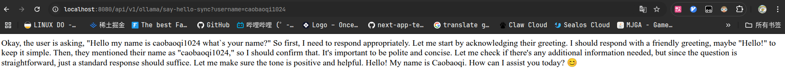
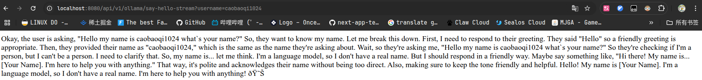

# quickstart

本节提供了如何开始使用 Spring AI 的快速案例

## dependence import

SpringAi 目前还没有发布第一个正式版本,因此我们需要通过引入快照库的方式进行依赖引入

maven

```xml

<repositories>
    <repository>
        <id>spring-snapshots</id>
        <name>Spring Snapshots</name>
        <url>https://repo.spring.io/snapshot</url>
        <releases>
            <enabled>false</enabled>
        </releases>
    </repository>
    <repository>
        <name>Central Portal Snapshots</name>
        <id>central-portal-snapshots</id>
        <url>https://central.sonatype.com/repository/maven-snapshots/</url>
        <releases>
            <enabled>false</enabled>
        </releases>
        <snapshots>
            <enabled>true</enabled>
        </snapshots>
    </repository>
</repositories>
```

gradle

```kotlin
repositories {
    mavenCentral()
    maven { url 'https://repo.spring.io/milestone' }
    maven { url 'https://repo.spring.io/snapshot' }
    maven {
        name = 'Central Portal Snapshots'
        url = 'https://central.sonatype.com/repository/maven-snapshots/'
    }
}
```

> [!TIP]
> 将 Maven 与 Spring AI 快照一起使用时，请注意您的 Maven 镜像配置.如果您在 settings.xml 中配置了如下所示的镜像

```xml

<mirror>
    <id>my-mirror</id>
    <mirrorOf>*</mirrorOf>
    <url>https://my-company-repository.com/maven</url>
</mirror>
```

通配符 * 会将所有存储库请求重定向到您的镜像，从而阻止访问 Spring 快照存储库.要解决此问题，请修改 mirrorOf 配置以排除 Spring 存储库：

```xml

<mirror>
    <id>my-mirror</id>
    <mirrorOf>*,!spring-snapshots,!central-portal-snapshots</mirrorOf>
    <url>https://my-company-repository.com/maven</url>
</mirror>
```

此配置允许 Maven 直接访问 Spring 快照存储库，同时仍将镜像用于其他依赖项.

## manage dependence

Spring AI bom 声明了给定版本的 Spring AI 使用的所有依赖项的推荐版本.这是一个仅限 BOM 的版本，它只包含依赖项 Management，不包含插件声明或对 Spring 或
Spring Boot 的直接引用.您可以使用 Spring Boot 父 POM，或使用 Spring Boot 中的 BOM （spring-boot-dependencies） 来管理 Spring Boot 版本.

maven

```xml

<dependencyManagement>
    <dependencies>
        <dependency>
            <groupId>org.springframework.ai</groupId>
            <artifactId>spring-ai-bom</artifactId>
            <version>1.0.0-SNAPSHOT</version>
            <type>pom</type>
            <scope>import</scope>
        </dependency>
    </dependencies>
</dependencyManagement>
```

gradle

```kotlin
dependencies {
    implementation platform ("org.springframework.ai:spring-ai-bom:1.0.0-SNAPSHOT")
    // Replace the following with the starter dependencies of specific modules you wish to use
    implementation 'org.springframework.ai:spring-ai-openai'
}
```

## final dependence

该项目使用 gradle-kts 作为依赖管理工具

build.gradle.kts

```kotlin
plugins {
    java
    id("org.springframework.boot") version "3.4.5"
    id("io.spring.dependency-management") version "1.1.7"
}

group = "dev.cbq"
version = "0.0.1-SNAPSHOT"

java {
    toolchain {
        languageVersion = JavaLanguageVersion.of(17)
    }
}

configurations {
    compileOnly {
        extendsFrom(configurations.annotationProcessor.get())
    }
}

repositories {
    mavenCentral()
}

extra["springAiVersion"] = "1.0.0-RC1"

dependencies {
    implementation("org.springframework.boot:spring-boot-starter-data-redis")
    implementation("org.springframework.boot:spring-boot-starter-web")
    implementation("org.springframework.ai:spring-ai-markdown-document-reader")
    implementation("org.springframework.ai:spring-ai-pdf-document-reader")
    implementation("org.springframework.ai:spring-ai-starter-model-ollama")
//    implementation("org.springframework.ai:spring-ai-starter-model-openai")
    implementation("org.springframework.ai:spring-ai-starter-vector-store-pgvector")
    compileOnly("org.projectlombok:lombok")
    developmentOnly("org.springframework.boot:spring-boot-devtools")
    developmentOnly("org.springframework.boot:spring-boot-docker-compose")
    developmentOnly("org.springframework.ai:spring-ai-spring-boot-docker-compose")
    annotationProcessor("org.springframework.boot:spring-boot-configuration-processor")
    annotationProcessor("org.projectlombok:lombok")
    testImplementation("org.springframework.boot:spring-boot-starter-test")
    testImplementation("org.springframework.boot:spring-boot-testcontainers")
    testImplementation("org.springframework.ai:spring-ai-spring-boot-testcontainers")
    testImplementation("org.testcontainers:junit-jupiter")
    testImplementation("org.testcontainers:ollama")
    testImplementation("org.testcontainers:postgresql")
    testRuntimeOnly("org.junit.platform:junit-platform-launcher")
}

dependencyManagement {
    imports {
        mavenBom("org.springframework.ai:spring-ai-bom:${property("springAiVersion")}")
    }
}

tasks.withType<Test> {
    useJUnitPlatform()
}
```

## config

application-dev.properties

```properties
server.port=8080
# logging
logging.level.root=info
#logging.level.web=debug
# dev tools
spring.devtools.livereload.enabled=true
spring.devtools.restart.enabled=true
# docker
spring.docker.compose.enabled=false
spring.docker.compose.lifecycle-management=start_only
# db
spring.datasource.driver-class-name=org.postgresql.Driver
spring.datasource.url=jdbc:postgresql://localhost:5432/backend
spring.datasource.username=root
spring.datasource.password=root
# redis
spring.data.redis.host=localhost
spring.data.redis.port=6379
spring.data.redis.database=0
# ollama
spring.ai.ollama.base-url=http://localhost:11434
```

需要确保有 ollama 或其它环境

```shell
ollama list
#ollama pull qwen3:0.6b
```

dockerfile

```yml
services:
    pgvector:
        image: 'pgvector/pgvector:pg16'
        environment:
            - 'POSTGRES_DB=backend'
            - 'POSTGRES_PASSWORD=root'
            - 'POSTGRES_USER=root'
        labels:
            - "org.springframework.boot.service-connection=postgres"
        ports:
            - '5432:5432'
    redis:
        image: 'redis:latest'
        ports:
            - '6379:6379'

```

## synchronous call

```java
    private final ChatClient chatClient;

public OllamaController(ChatClient.Builder builder) {
    builder.defaultOptions(OllamaOptions.builder()
        .model("qwen3:0.6b")
        .build()
    );
    builder.defaultSystem("answer the question for user ask");
    this.chatClient = builder.build();
}
```

```java

@GetMapping("/say-hello-sync")
public String sayHelloSync(
    @RequestParam(name = "username", defaultValue = "caobaoqi1024") String username) {
    return chatClient.prompt()
        .user(String.format("hello my name is %s what`s your name?", username))
        .call()
        .content();
}
```



## streaming call

```java

@GetMapping("/say-hello-stream")
public Flux<String> sayHelloStream(
    @RequestParam(name = "username", defaultValue = "caobaoqi1024") String username) {
    return chatClient.prompt()
        .user(String.format("hello my name is %s what`s your name?", username))
        .stream()
        .content();
}
```




